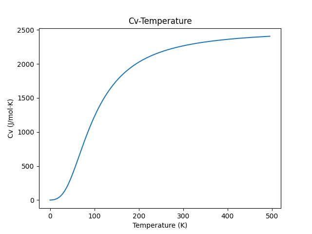
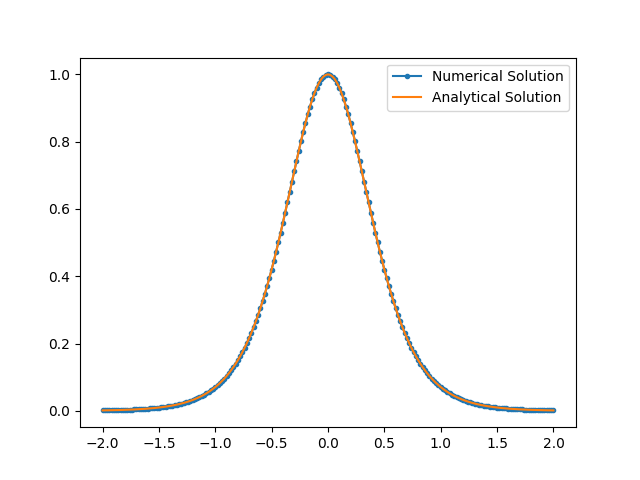

# Homework 2

Author: Wang Haozhe

Date: 2024/3/17

## Problem 2.1

### Code:
```python
#!/usr/local/bin/python3.11
# -*- coding: UTF-8 -*-
# @Project : Computational_Physics
# @File    : Problem2_1.py
# @Author  : Albert Wang
# @Time    : 2024/3/17
# @Brief   : None

from numpy import pi, cos, tan, ones, copy, linspace, exp
from matplotlib import pyplot as plt

number_density = 6.022e28
theta_d = 428
N = 50
V = 1e-3
kb = 1.38064852e-23
result = []


def gaussxw(N):
    # Initial approximation to roots of the Legendre polynomial
    a = linspace(3, 4 * N - 1, N) / (4 * N + 2)
    x = cos(pi * a + 1 / (8 * N * N * tan(a)))

    # Find roots using Newton's method
    epsilon = 1e-15
    delta = 1.0
    while delta > epsilon:
        p0 = ones(N, float)
        p1 = copy(x)
        for k in range(1, N):
            p0, p1 = p1, ((2 * k + 1) * x * p1 - k * p0) / (k + 1)
        dp = (N + 1) * (p0 - x * p1) / (1 - x * x)
        dx = p1 / dp
        x -= dx
        delta = max(abs(dx))

    # Calculate the weights
    w = 2 * (N + 1) * (N + 1) / (N * N * (1 - x * x) * dp * dp)
    return x, w


def gaussxwab(N, a, b):
    x, w = gaussxw(N)
    return 0.5 * (b - a) * x + 0.5 * (b + a), 0.5 * (b - a) * w


def f(x):
    return (x ** 4 * exp(x)) / (exp(x) - 1) ** 2  # Integrand


def calculate_cv(temperature):
    s = 0.0
    xp, wp = gaussxwab(N, 0, theta_d / temperature)
    for k in range(N):
        s += wp[k] * f(xp[k])
    s *= 9 * V * number_density * kb * (temperature / theta_d) ** 3
    print(s)
    result.append(s)


if __name__ == '__main__':
    # Calculate the heat capacity from T=5K to 500K
    for t in range(5, 500 + 1):
        calculate_cv(t)
    plt.plot(result)
    plt.xlabel("Temperature (K)")
    plt.ylabel("Cv (J/mol·K)")
    plt.title("Cv-Temperature")
    plt.show()
```

### Result:


## Problem 2.2

### Code:
```python
#!/usr/local/bin/python3.11
# -*- coding: UTF-8 -*-
# @Project : Computational_Physics
# @File    : Problem2_2.py
# @Author  : Albert Wang
# @Time    : 2024/3/17
# @Brief   : None

from numpy import tanh, linspace
from matplotlib import pyplot as plt


def f(x):
    return 1 + 0.5 * tanh(2 * x)


def f_first_derivative(x):
    return 1 - tanh(2 * x) ** 2  # The analytic derivative of f(x)


def central_difference(x):
    h = 1e-3  # Set h
    return (f(x + h / 2) - f(x - h / 2)) / h


if __name__ == '__main__':
    x_ = linspace(-2, 2, 201)
    plt.plot(x_, central_difference(x_), color="#1f77b4", label="Numerical Solution",
             marker=".")  # Plot the numerical solution as dots
    plt.plot(x_, f_first_derivative(x_), color="#ff7f0e", label="Analytical Solution")
    plt.legend()
    plt.show()
```

### Result:


## Problem 2.3

For the forward difference, the error term is given by:
$$
E_{f}  = h f''(x)
$$
For the central difference, the error term is given by:
$$
E_{f}  = h^2 f'''(x)
$$
Therefore, we get:
$$
|h f''(x)| < |h^2 f'''(x)|
$$

So, 
$$
h > |\frac{f''(x)}{f'''(x)}|
$$
