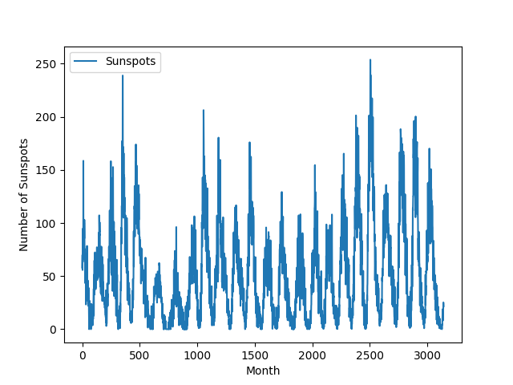
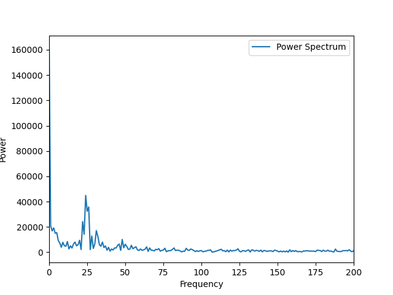
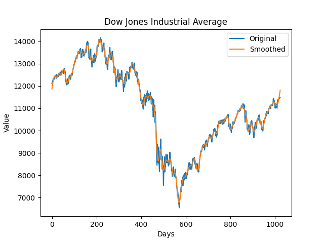
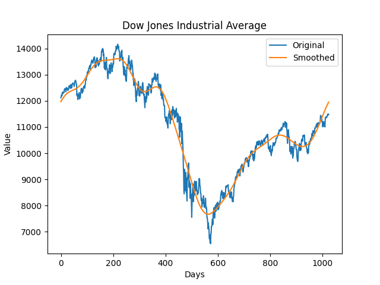

# Homework 5

Author: Wang Haozhe

Date: 2024/5/3

## Problem 5.1

### Code:
```python
#!/usr/local/bin/python3.11
# -*- coding: UTF-8 -*-
# @Project : Computational_Physics
# @File    : Problem5_1.py
# @Author  : Albert Wang
# @Time    : 2024/5/3
# @Brief   : None

import numpy as np

from matplotlib import pyplot as plt


def dft(y):
    N_ = len(y)
    c_ = np.zeros(N_ // 2 + 1, complex)
    for k in range(N_ // 2 + 1):
        for n in range(N_):
            c_[k] += y[n] * np.exp(-2j * np.pi * k * n / N_)
    return c_


data = np.loadtxt("sunspots.txt", float)  # Load file
month = data[:, 0]  # Get month
spot = data[:, 1]  # Get spot

plt.plot(month, spot, label="Sunspots")  # Plot
plt.xlabel("Month")
plt.ylabel("Number of Sunspots")
plt.legend()
plt.show()

c = dft(spot)  # Discrete Fourier Transform
plt.plot(np.abs(c), label="Power Spectrum")  # Plot
plt.xlabel("Frequency")
plt.ylabel("Power")
plt.legend()
plt.xlim(0, 200)
plt.show()

# Find the frequency with the maximum power
c[0] = 0
max_power = np.max(np.abs(c) ** 2)
max_index = np.where(np.abs(c) ** 2 == max_power)
frequency = max_index[0][0]
print("The period with the maximum power is", len(spot) / frequency)
```

### Result:


The period is 131 months.

## Problem 5.2

### Code
```python
#!/usr/local/bin/python3.11
# -*- coding: UTF-8 -*-
# @Project : Computational_Physics
# @File    : Problem5_2.py
# @Author  : Albert Wang
# @Time    : 2024/5/3
# @Brief   : None

import numpy as np

from matplotlib import pyplot as plt


data = np.loadtxt("dow.txt", float)  # Load file

c = np.fft.rfft(data)  # Discrete Fourier Transform
c[int(len(c) * 0.1) :] = 0
# c[int(len(c) * 0.02) :] = 0
data_inverse = np.fft.irfft(c)

plt.plot(data, label="Original")  # Plot
plt.plot(data_inverse, label="Smoothed")
plt.xlabel("Days")
plt.ylabel("Value")
plt.title("Dow Jones Industrial Average")
plt.legend()
plt.show()
```

### Result


The curve has been smoothed.
