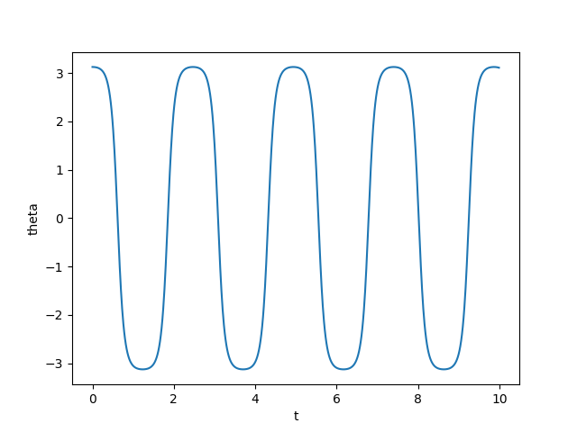

# Homework 6

Author: Wang Haozhe

Date: 2024/5/25

## Problem 6.1

### Code:
```python
#!/usr/local/bin/python3.11
# -*- coding: UTF-8 -*-
# @Project : Computational_Physics
# @File    : Problem6_1.py
# @Author  : Albert Wang
# @Time    : 2024/5/24
# @Brief   : None

import numpy as np
import pylab as plt


def f(r, t):
    x = r[0]
    y = r[1]
    fx = alpha * x - beta * x * y
    fy = gamma * x * y - delta * y
    return np.array([fx, fy], float)


alpha = 1.0
beta = 0.5
gamma = 0.5
delta = 2

a = 0.0
b = 30.0
N = 1000
h = (b - a) / N

tpoints = np.arange(a, b, h)
xpoints = []
ypoints = []

r = np.array([2.0, 2.0], float)
for t in tpoints:
    xpoints.append(r[0])
    ypoints.append(r[1])
    k1 = h * f(r, t)
    k2 = h * f(r + 0.5 * k1, t + 0.5 * h)
    k3 = h * f(r + 0.5 * k2, t + 0.5 * h)
    k4 = h * f(r + k3, t + h)
    r += (k1 + 2 * k2 + 2 * k3 + k4) / 6

plt.plot(tpoints, xpoints, label="Prey")
plt.plot(tpoints, ypoints, label="Predator")
plt.xlabel("Time")
plt.legend()
plt.show()
```

### Result:

Predator growth leads to exponential decay of prey, and prey decay leads to exponential decay of predators, resulting in oscillatory.

## Problem 6.2

### Code
```python
#!/usr/local/bin/python3.11
# -*- coding: UTF-8 -*-
# @Project : Computational_Physics
# @File    : Problem6_2.py
# @Author  : Albert Wang
# @Time    : 2024/5/24
# @Brief   : None

import math
import numpy as np
import pylab as plt
import vpython


def f(r, t):
    theta = r[0]
    omega = r[1]
    f_theta = omega
    f_omega = -(g / l) * math.sin(theta)
    return np.array([f_theta, f_omega], float)


g = 9.81
l = 0.1

a = 0.0
b = 10.0
N = 1000
h = (b - a) / N

tpoints = np.arange(a, b, h)
xpoints = []
ypoints = []

r = np.array([179 / 57.3, 0], float)
for t in tpoints:
    xpoints.append(r[0])
    ypoints.append(r[1])
    k1 = h * f(r, t)
    k2 = h * f(r + 0.5 * k1, t + 0.5 * h)
    k3 = h * f(r + 0.5 * k2, t + 0.5 * h)
    k4 = h * f(r + k3, t + h)
    r += (k1 + 2 * k2 + 2 * k3 + k4) / 6
plt.plot(tpoints, xpoints)
plt.xlabel("t")
plt.ylabel("theta")
plt.show()

# Animation
scene = vpython.canvas()
bob = vpython.sphere(pos=vpython.vector(1, 0, 0), radius=0.1)
arm = vpython.curve(
    pos=[vpython.vector(0, 0, 0), vpython.vector(1, 0, 0)], color=vpython.color.blue
)

for theta in xpoints:
    vpython.rate(30)
    x = math.sin(theta)
    y = -math.cos(theta)
    bob.pos = vpython.vector(x, y, 0)
    arm.clear()
    arm = vpython.curve(
        pos=[vpython.vector(0, 0, 0), vpython.vector(x, y, 0)], color=vpython.color.blue
    )
```

### Result

